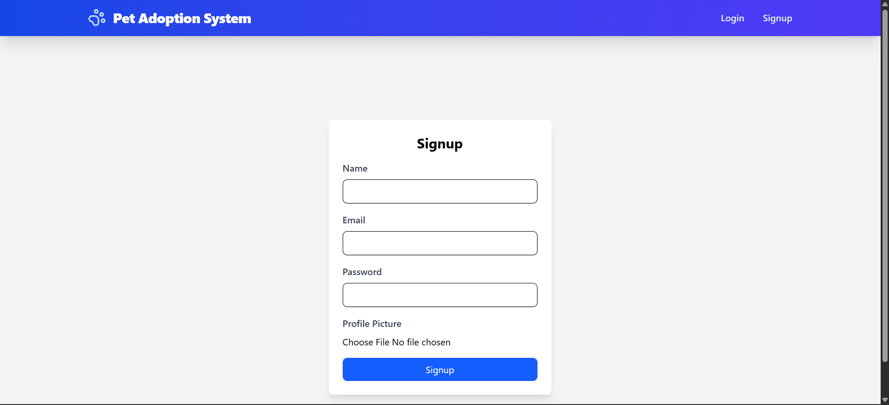
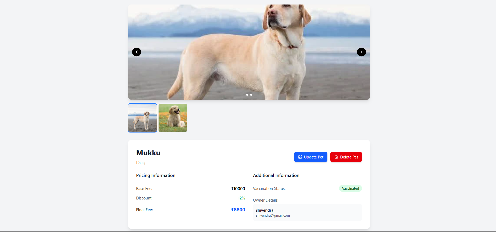
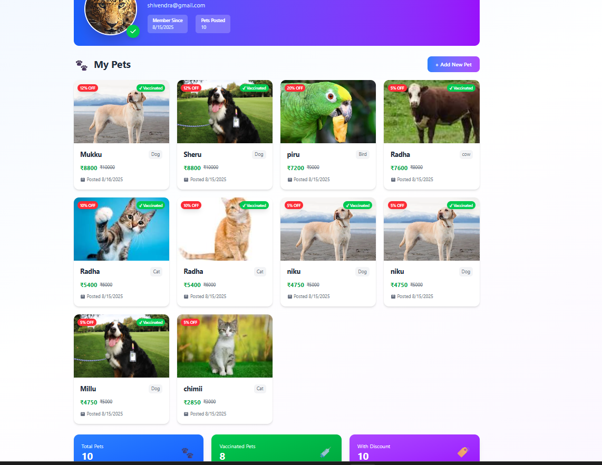
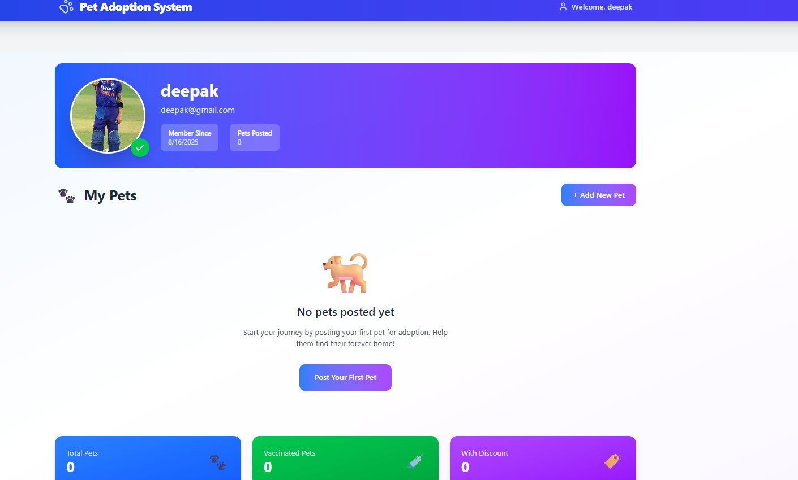
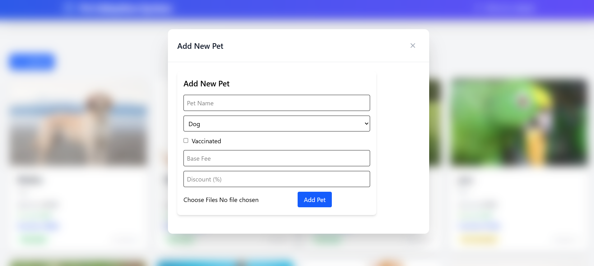

# 🐾 Pet Adoption System (MERN Stack)

A full-stack **Pet Adoption Platform** built with the **MERN stack** (MongoDB, Express.js, React, Node.js) that allows users to **sign up, log in, browse pets, post pets for adoption, and manage their profiles**.  
Authentication is powered by **JWT tokens stored in HttpOnly cookies** for enhanced security.

---

## 🔗 Live Demo

[Site Live Link](https://petadoptionsys-1.onrender.com)
[Video Link](https://youtu.be/jt8dQUKOHks)

## Docs

**See All Documents under the docs folder of this project - API Doc, AI Doc, commits, architecture and local setup Doc.**

---

## 📜 Features

- 👤 User authentication (signup & login) with JWT cookies
- 🐶 CRUD operations for pets (create, view, update, delete)
- 🔍 View all pets & filter by owner
- 🖼 Upload multiple pet images
- 🛡 Protected routes for logged-in users
- 📱 Fully responsive frontend with Tailwind CSS
- 🧪 Backend tests using Jest + Supertest

---

🎮 How It Works
**Sign Up/Login** – Create your personal account
**Post Your Pets** – Add pets as they will be visible to all other users
**See Your Profile** –  View Your profile and See your posted pets details
**Update/Delete** – Update or delete any if wanted
**Stay Motivated** – Filter, search & focus on goals

