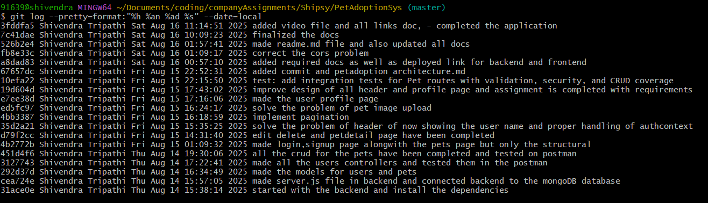

# Commit History

Below is the screenshot of all commits with date and time:

## Also to see commits on terminal - run below command

git log --pretty=format:"%h %an %ad %s" --date=local

## All commits of the image

$ git log --pretty=format:"%h %an %ad %s" --date=local

10efa22 Shivendra Tripathi Fri Aug 15 22:15:50 2025 test: add integration tests for Pet routes with validation, security, and CRUD coverage

19d604d Shivendra Tripathi Fri Aug 15 17:43:02 2025 improve design of all header and profile page and assignment is completed with requirements

e7ee38d Shivendra Tripathi Fri Aug 15 17:16:06 2025 made the user profile page

ed5fc97 Shivendra Tripathi Fri Aug 15 16:24:17 2025 solve the problem of pet image upload

4bb3387 Shivendra Tripathi Fri Aug 15 16:18:59 2025 implement pagination

35d2a21 Shivendra Tripathi Fri Aug 15 15:35:25 2025 solve the problem of header of now showing the user name and proper handling of authcontext

d79f2cc Shivendra Tripathi Fri Aug 15 14:31:40 2025 edit delete and petdetail page have been completed

4b2772b Shivendra Tripathi Fri Aug 15 01:09:32 2025 made login,signup page alongwith the pets page but only the structural

451d4f6 Shivendra Tripathi Thu Aug 14 19:30:06 2025 all the crud for the pets have been completed and tested on postman

3127743 Shivendra Tripathi Thu Aug 14 17:22:41 2025 made all the users controllers and tested them in the postman

292d37d Shivendra Tripathi Thu Aug 14 16:34:49 2025 made the models for users and pets

cea724e Shivendra Tripathi Thu Aug 14 15:57:05 2025 made server.js file in backend and connected backend to the mongoDB database

31ace0e Shivendra Tripathi Thu Aug 14 15:38:14 2025 started with the backend and install the dependencies
